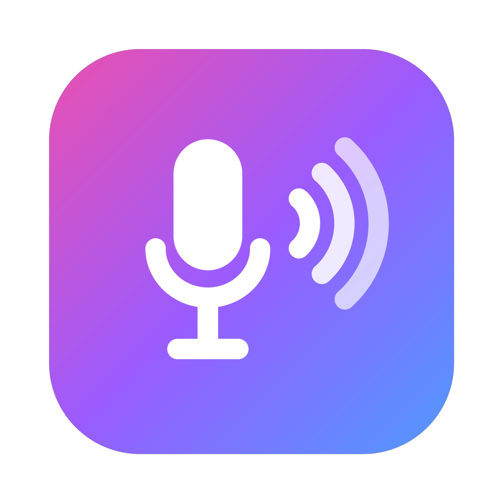

<p align="center"></p>

# EarBridge

안드로이드 폰 마이크 소리를 맥에서 실시간으로 듣는 앱.

| 폴더 | 내용 |
|---|---|
| `android/` | 폰 앱 (Kotlin + Jetpack Compose). 마이크를 포그라운드 서비스로 녹음해서 보낸다. 화면이 꺼져도 계속 보낸다 |
| `mac/` | 맥 앱 (SwiftUI). 폰을 자동으로 찾아서 재생한다. 볼륨은 400%까지 |
| `relay/` | 다른 네트워크용 중계 서버 (Node, 의존성 없음) |

## 연결 방식

- **같은 와이파이**: 폰이 Bonjour(`_earbridge._tcp`)로 알리고 TCP 7700으로 직접 보낸다. 맥 앱이 알아서 붙는다.
- **다른 네트워크**: 폰에서 "다른 네트워크에서도 듣기"를 켜면 8자리 코드가 나온다. 맥 앱에 그 코드를 넣으면 중계 서버를 거쳐 듣는다. 듣는 맥이 없을 때는 폰이 보내지 않아서 데이터를 아낀다.
- 맥 앱 순서: 코드가 있으면 원격으로 대기 → 같은 와이파이에서 폰이 보이면 직결 → 직결이 5초 안에 안 되면 원격.

## 소리 형식

48kHz 모노 16비트 리틀엔디언 PCM. 접속하면 먼저 9바이트 헤더(`EBR1` + 샘플레이트 uint32 LE + 채널 수 uint8)를 보내고 그 뒤로 PCM이 이어진다.
중계 WebSocket은 바이너리로 같은 바이트를 보내고, 텍스트 메시지로 `start`(새 스트림), `gone`(폰 끊김), `listeners:N`(폰에게 듣는 수)을 알린다.

## 빌드

```bash
# 맥
cd mac && ./build_app.sh --install      # /Applications 에 넣고 실행

# 안드로이드
cd android && ./gradlew assembleDebug   # app/build/outputs/apk/debug/app-debug.apk

# 중계 서버 (라즈베리파이)
cd relay && ./deploy.sh
```

중계 주소는 `android/.../RemoteSender.kt`의 `RELAY`와 `mac/Sources/EarBridge/Bridge.swift`의 `relayURL`에 있다. 직접 서버를 띄운다면 둘 다 바꾸면 된다.
